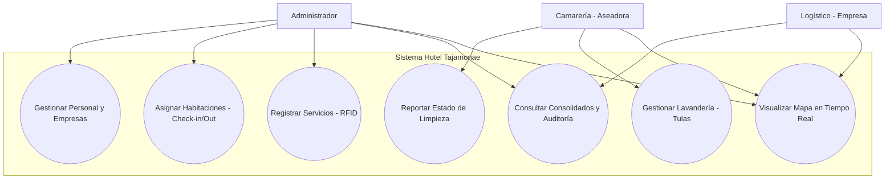
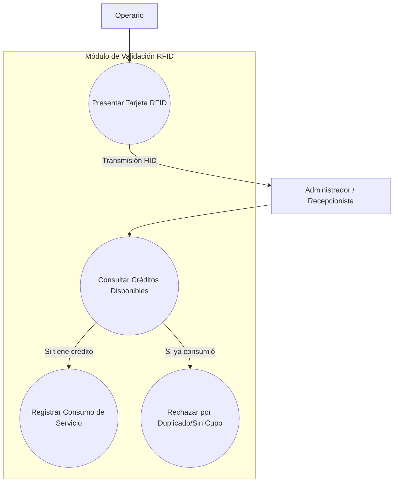
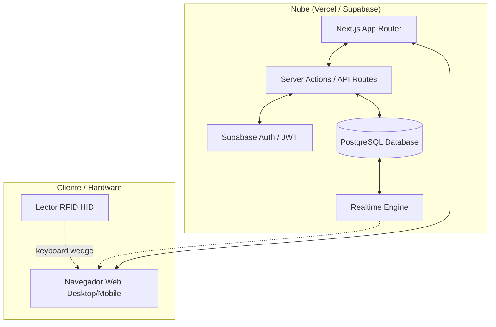
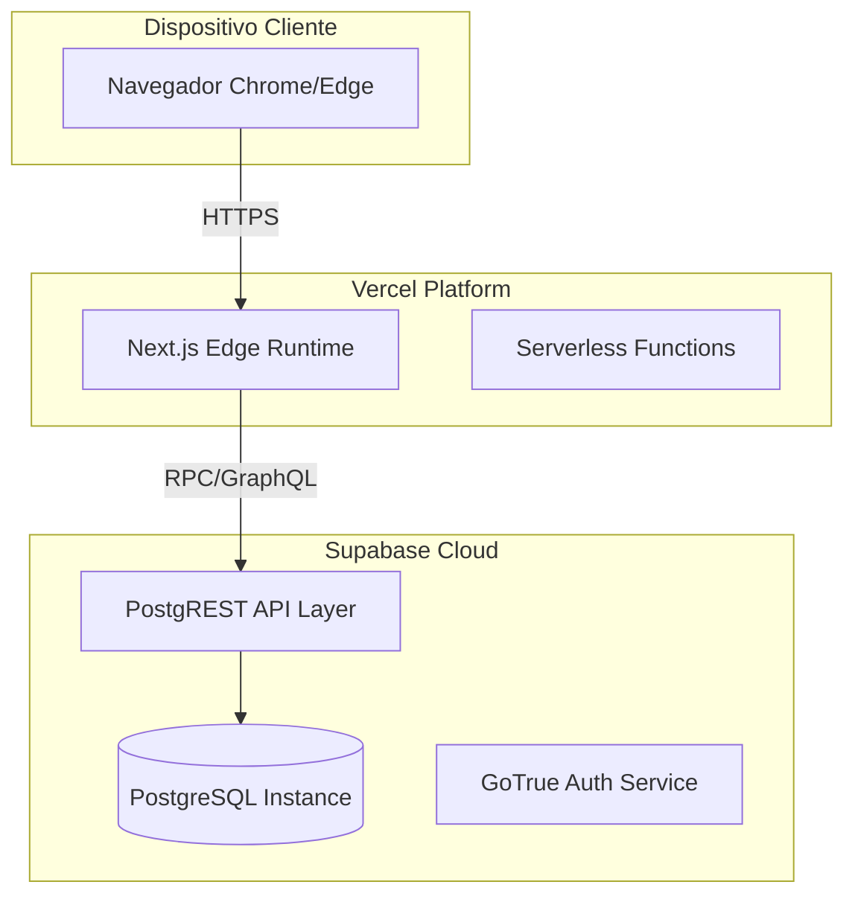
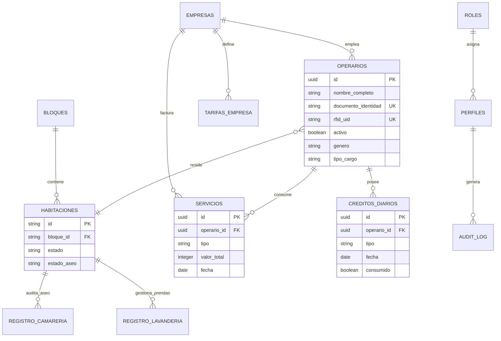
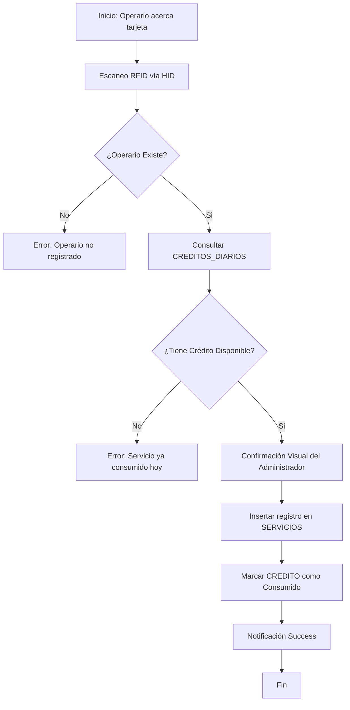
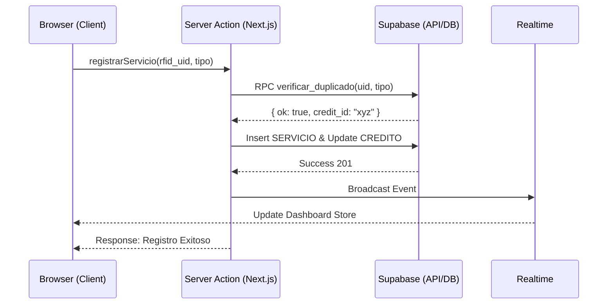
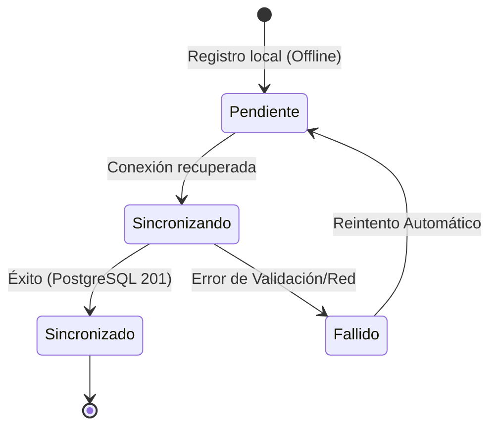
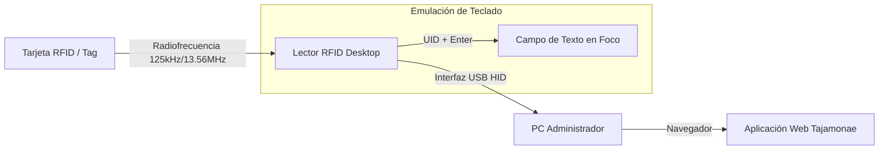
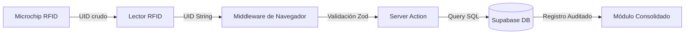

# Documentación Técnica: Diagramas del Sistema Hotel Tajamonae

Este documento contiene la representación visual y técnica de la arquitectura, procesos y requerimientos del sistema Hotel Tajamonae. Diseñado para la sustentación académica y el soporte técnico industrial.

---

## 1. Diagramas de Requerimientos y Casos de Uso

Estos diagramas justifican el propósito del sistema y definen las interacciones fundamentales entre los actores y los procesos de negocio.

### 1.1 Diagrama de Casos de Uso General
Este diagrama ilustra cómo los tres actores principales interactúan con los módulos centrales: Hospitalidad (Hospedaje), Alimentación (Servicios) y Mantenimiento (Camarería).

**Explicación:** El **Administrador** posee control total sobre la configuración y auditoría. El **Logístico** de cada empresa tiene un acceso restringido para supervisar sus consumos y el estado de sus empleados. La **Aseadora** se enfoca exclusivamente en la operatividad de las habitaciones y el flujo de lavandería.

### 1.2 Casos de Uso por Módulo: Validación RFID
Detalle del proceso crítico de validación de identidad y consumo mediante radiofrecuencia.

**Explicación:** Este flujo garantiza la integridad financiera evitando el doble cobro. El sistema consulta la tabla de `creditos_diarios` antes de permitir cualquier inserción en la tabla de `servicios`.

---

## 2. Diagramas de Arquitectura y Estructura

Representan la construcción técnica y el despliegue del ecosistema digital.

### 2.1 Diagrama de Arquitectura (C4 Model - Contexto/Contenedor)
El sistema utiliza una arquitectura moderna basada en Next.js y Supabase.

**Explicación:** Se emplea un patrón de **Server components** para seguridad. La comunicación con la base de datos está protegida por **RLS (Row Level Security)**, asegurando que cada empresa solo acceda a sus propios datos. El motor **Realtime** actualiza el mapa de habitaciones instantáneamente cuando la aseadora reporta cambios.

### 2.2 Diagrama de Despliegue (Deployment)
Infraestructura Cloud del proyecto.

**Explicación:** El sistema es **serverless**, eliminando la necesidad de gestionar servidores físicos. Vercel escala el frontend globalmente, mientras Supabase gestiona la persistencia y autenticación de grado industrial.

### 2.3 Modelo Entidad-Relación (DER)
Representación de las tablas y relaciones lógicas integradas en Supabase.

**Explicación:** El modelo está normalizado en 3NF. La tabla `CREDITOS_DIARIOS` actúa como un semáforo lógico para la tabla `SERVICIOS`. Se han añadido campos de auditoría y metadatos (`genero`, `tipo_cargo`) para cumplir con los requerimientos industriales de segregación de personal.

---

## 3. Diagramas de Comportamiento y Procesos

Estos diagramas explican la lógica operativa y la secuencia de eventos del software.

### 3.1 Diagrama de Actividades: Flujo de Proceso RFID
Describe el paso a paso desde el escaneo hasta la persistencia.

**Explicación:** Este flujo asegura que el sistema sea **resiliente a errores de doble escaneo**. La validación de créditos es atómica y ocurre en el backend mediante procedimientos almacenados (RPC).

### 3.2 Diagrama de Secuencia: Transacción de Validación
Detalla la comunicación entre el cliente y las capas de backend.

**Explicación:** Se utiliza un patrón asíncrono donde la UI se actualiza reactivamente a través de los eventos de **Realtime** de Supabase, permitiendo que otros administradores vean el consumo al instante.

### 3.3 Diagrama de Estado del Servicio (Offline-First)
Explica la arquitectura planificada para la resiliencia en zonas de baja conectividad (Campo Rubiales).

**Explicación:** En zonas petroleras de conectividad intermitente, el sistema implementa una **estrategia de cola de sincronización**. Los registros se almacenan localmente hasta que el navegador detecta señal estable para despachar el conjunto de Server Actions.

---

## 4. Diagramas de Integración de Hardware

Específicos para el componente de radiofrecuencia.

### 4.1 Diagrama de Bloques del Hardware
Muestra la conexión física y lógica del lector.

**Explicación:** El hardware funciona como un periférico **HID (Human Interface Device)**. Esto permite una compatibilidad universal sin necesidad de instalar drivers específicos, inyectando el UID directamente en los formularios del software.

### 4.2 Diagrama de Flujo de Datos (DFD) Nivel 1
Visualiza el movimiento de la cadena de datos desde el origen.

**Explicación:** El flujo transforma un evento físico (acercar tarjeta) en un registro logístico digital inmutable. La cadena de datos viaja encriptada vía HTTPS desde que sale del navegador hacia la infraestructura de Supabase.
