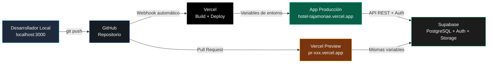
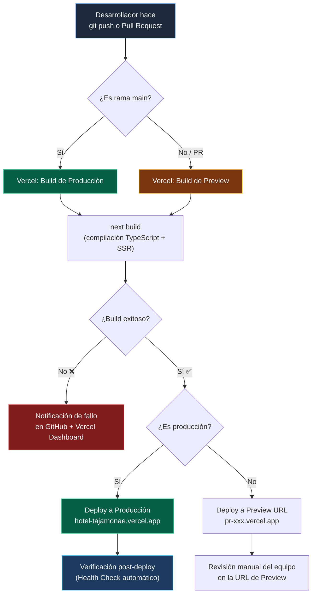

# Manual de Despliegue / DevOps — Hotel Tajamonae

## 1. Arquitectura de Infraestructura



---

## 2. Stack de Producción

| Componente | Servicio | Plan | Propósito |
| :--- | :--- | :--- | :--- |
| **Frontend + SSR** | Vercel | Pro / Hobby | Hosting, CDN global, Server-Side Rendering (Next.js 16) |
| **Base de Datos** | Supabase (PostgreSQL 15) | Free / Pro | Datos relacionales, Row Level Security, Auth, Storage |
| **Autenticación** | Supabase Auth | Incluido | JWT, gestión de sesiones con cookies HttpOnly |
| **DNS** | Vercel / Dominio propio | — | Enrutamiento del dominio personalizado |

---

## 3. Flujo de CI/CD (Integración y Despliegue Continuo)

### 3.1 Diagrama del Pipeline



### 3.2 ¿Cómo se asegura que un cambio no rompa producción?

El sistema implementa **4 capas de protección** antes de que cualquier cambio llegue a los usuarios:

#### Capa 1: Compilación TypeScript Estricta
El archivo `tsconfig.json` tiene habilitado `"strict": true`. Cualquier error de tipos, variables indefinidas, o imports rotos causará que `next build` falle y **Vercel rechazará el deploy automáticamente**.

#### Capa 2: Pruebas Unitarias (Vitest)
```bash
pnpm test:coverage
```
Se ejecutan pruebas aisladas de la lógica de negocio (check-in RFID, sobrebooking, aislamiento RLS, offline sync) con mocks de Supabase. Si alguna falla, el desarrollador lo detecta antes del push.

#### Capa 3: Preview Deployments de Vercel
Cada Pull Request genera automáticamente una URL de preview aislada (ej. `pr-15-hotel-tajamonae.vercel.app`). El equipo puede probar la funcionalidad completa en un entorno idéntico a producción **sin afectar la app en uso**.

#### Capa 4: Rollback Instantáneo
Vercel almacena cada deployment como una imagen inmutable. Si un deploy causa problemas, se puede revertir a cualquier versión anterior en **menos de 10 segundos** desde el Dashboard de Vercel → Deployments → "Promote to Production".

---

## 4. Variables de Entorno

Las siguientes variables son requeridas tanto en el entorno local (`.env.local`) como en Vercel (Settings → Environment Variables):

| Variable | Descripción | Ejemplo |
| :--- | :--- | :--- |
| `NEXT_PUBLIC_SUPABASE_URL` | URL del proyecto Supabase | `https://xxxxx.supabase.co` |
| `NEXT_PUBLIC_SUPABASE_ANON_KEY` | Clave pública (anon) para el cliente | `eyJhbGciOi...` |
| `SUPABASE_SERVICE_ROLE_KEY` | Clave de servicio (solo servidor) | `eyJhbGciOi...` |

> [!CAUTION]
> La clave `SUPABASE_SERVICE_ROLE_KEY` **NUNCA** debe exponerse al cliente. Solo se usa en Server Actions y API Routes del lado del servidor. En Vercel, marcarla como "Sensitive" para ocultarla de los logs.

---

## 5. Gestión de Migraciones de Base de Datos

Las migraciones SQL se encuentran en `supabase/migrations/` y se ejecutan en orden cronológico:

| Migración | Fecha | Propósito |
| :--- | :--- | :--- |
| `perfiles_autoprovision.sql` | 2026-03-30 | Trigger para crear perfil automático al registrarse |
| `fix_rls_public.sql` | 2026-03-31 | Corrección de políticas RLS públicas |
| `timezone_fix.sql` | 2026-04-01 | Ajuste de zona horaria Colombia (UTC-5) |
| `camareria_features.sql` | 2026-04-12 | Tabla de registro de camarería con fotos y checklist |
| `operarios_constraints.sql` | 2026-04-20 | Restricciones UNIQUE en operarios |
| `security_hardening.sql` | 2026-05-27 | Hardening completo: funciones SECURITY DEFINER, RLS restrictivo |
| `fix_admin_rls.sql` | 2026-05-28 | Corrección de políticas para acceso admin con service_role |

### Aplicar migraciones en producción:
```bash
# Opción 1: Desde la CLI de Supabase (recomendado)
npx supabase db push

# Opción 2: Ejecutar manualmente desde el SQL Editor de Supabase Dashboard
# Copiar y pegar el contenido de cada archivo .sql en orden
```

---

## 6. Proceso de Deploy Paso a Paso

### 6.1 Deploy Inicial (Primera vez)

```bash
# 1. Instalar Vercel CLI
npm i -g vercel

# 2. Vincular el proyecto
cd hotel-tajamonae
vercel link

# 3. Configurar variables de entorno en Vercel
vercel env add NEXT_PUBLIC_SUPABASE_URL
vercel env add NEXT_PUBLIC_SUPABASE_ANON_KEY
vercel env add SUPABASE_SERVICE_ROLE_KEY

# 4. Deploy a producción
vercel --prod
```

### 6.2 Deploys Subsiguientes (Automáticos)
Simplemente hacer `git push origin main`. Vercel detecta el push vía webhook de GitHub y ejecuta el pipeline completo automáticamente.

### 6.3 Deploy de Emergencia (Hotfix)
```bash
# 1. Crear rama de hotfix
git checkout -b hotfix/nombre-del-fix

# 2. Aplicar el fix y commitear
git add . && git commit -m "fix: descripción del problema"

# 3. Push directo (genera Preview)
git push origin hotfix/nombre-del-fix

# 4. Verificar en la URL de Preview
# 5. Merge a main cuando esté validado
git checkout main && git merge hotfix/nombre-del-fix && git push
```

---

## 7. Monitoreo y Observabilidad

| Herramienta | Qué monitorea | Acceso |
| :--- | :--- | :--- |
| **Vercel Analytics** | Core Web Vitals (LCP, INP, CLS), tráfico | Dashboard de Vercel |
| **Vercel Logs** | Logs de Server Actions y API Routes en tiempo real | Vercel → Deployments → Logs |
| **Supabase Dashboard** | Queries, Auth sessions, Storage, DB health | `app.supabase.com` |
| **Supabase Logs** | PostgreSQL query logs, Auth logs, API logs | Supabase → Logs Explorer |

---

## 8. Checklist Pre-Deploy

- [ ] `pnpm build` completa sin errores
- [ ] `pnpm test:coverage` pasa todas las pruebas
- [ ] Variables de entorno configuradas en Vercel
- [ ] Migraciones SQL aplicadas en Supabase producción
- [ ] Políticas RLS verificadas (ejecutar audit de seguridad)
- [ ] Preview deployment probado por el equipo
- [ ] Backup de base de datos realizado (Supabase → Database → Backups)
