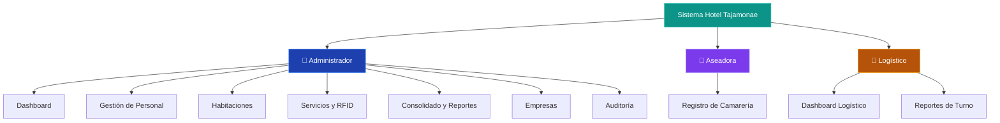
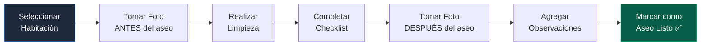

# Manual de Usuario — Sistema Hotel Tajamonae

## 1. Introducción

El Sistema Hotel Tajamonae es una plataforma web diseñada para gestionar las operaciones diarias del hotel, incluyendo el control de personal operario, registro de servicios (desayuno, almuerzo, cena, hospedaje, lavandería), gestión de habitaciones y auditoría de camarería.

### Roles del Sistema

---

## 2. Acceso al Sistema

### 2.1 Inicio de Sesión

1. Abrir el navegador e ir a la URL del sistema.
2. Ingresar el **correo electrónico** y la **contraseña** proporcionados por el administrador.
3. Hacer clic en **"Iniciar Sesión"**.

El sistema detectará automáticamente el rol del usuario y lo redirigirá a su panel correspondiente:
- **Admin** → `/dashboard`
- **Aseadora** → `/camareria`
- **Logístico** → `/logistico/dashboard`

### 2.2 Cerrar Sesión

- En el **sidebar izquierdo** (escritorio): hacer clic en **"Logout"** en la parte inferior.
- En la **barra superior**: hacer clic en el avatar (iniciales del nombre) → **"Cerrar Sesión"**.

---

## 3. Panel de Administrador

### 3.1 Dashboard

El Dashboard es la vista principal del administrador. Muestra un resumen en tiempo real de:

| Indicador | Descripción |
| :--- | :--- |
| **Operarios Activos** | Número de operarios registrados actualmente en el hotel |
| **Servicios Hoy** | Total de servicios (comidas, hospedaje, lavandería) registrados en el día |
| **Ocupación** | Porcentaje de ocupación de las habitaciones |
| **Omisiones** | Servicios que debieron registrarse pero no se realizaron |

Adicionalmente incluye:
- **Gráfico de Servicios por Empresa**: Distribución de servicios entre las empresas contratistas.
- **Rendimiento de Camarería**: Tiempo promedio de limpieza por aseadora (en minutos).
- **Actividad Reciente**: Últimos 6 servicios registrados con marca de tiempo.

---

### 3.2 Habitaciones

Vista de plano interactivo del hotel organizado por bloques (Bloque 1, Bloque 2). Cada habitación muestra:

- **Estado de ocupación**: Indica cuántas personas están hospedadas vs. la capacidad total.
- **Estado de aseo**: "Aseo listo" (verde) o "En proceso" (ámbar).
- **Registro de camarería**: Fotos antes/después, checklist de limpieza, observaciones.

**Acciones disponibles:**
- Hacer clic en una habitación para ver su detalle completo.
- Ver fotos de antes y después de la limpieza.
- Revisar el checklist de verificación de aseo.

---

### 3.3 Gestión de Personal

Módulo central para administrar los operarios (trabajadores) de las empresas contratistas.

#### Funcionalidades principales:

| Acción | Cómo hacerlo |
| :--- | :--- |
| **Ver operarios activos** | Se listan automáticamente al entrar a la sección |
| **Importar desde Excel** | Arrastrar archivo `.xlsx` a la zona de carga o hacer clic en "Importar" |
| **Asignar habitación** | Seleccionar habitación en el dropdown junto al operario |
| **Cambiar turno** | Usar el botón de cambio de turno en la tabla |
| **Activar/Desactivar** | Toggle de estado en cada fila |

#### Columnas de la tabla:

| Columna | Descripción |
| :--- | :--- |
| Nombre | Nombre completo del operario |
| Empresa | Empresa contratista (MASA, INMEL, MR ING, etc.) |
| Cédula | Documento de identidad |
| Habitación | Habitación asignada actualmente |
| Check-in | Fecha de registro de entrada |
| Estado | Activo o Inactivo |

---

### 3.4 Servicios y RFID

Módulo para registrar los servicios diarios usando tarjetas RFID o manualmente.

#### Selector de Servicio Activo
En la barra superior hay un **selector de servicio** que determina qué tipo de servicio se registra al pasar la tarjeta RFID:
- 🍳 Desayuno
- 🍽 Almuerzo
- 🌙 Cena
- 🛏 Hospedaje
- 👕 Lavandería

#### Registro por RFID
1. Seleccionar el tipo de servicio activo en el selector.
2. El operario pasa su tarjeta RFID por el lector.
3. El sistema identifica al operario y registra el servicio automáticamente.

#### Registro Manual
1. Ir a la sección de Servicios.
2. Buscar al operario por nombre.
3. Seleccionar el tipo de servicio.
4. Confirmar el registro.

---

### 3.5 Consolidado (Reportes)

Vista con filtros avanzados para generar reportes de todos los servicios registrados.

**Filtros disponibles:**
- Por fecha (rango de fechas)
- Por empresa contratista
- Por tipo de servicio
- Por operario específico

**Exportación:**
- **PDF**: Genera un documento formal con tablas y totales.
- **Excel**: Exporta los datos filtrados a un archivo `.xlsx` descargable.

---

### 3.6 Empresas Contratistas

Administración de las empresas que envían operarios al hotel.

| Acción | Descripción |
| :--- | :--- |
| **Crear empresa** | Nombre completo, sigla, NIT |
| **Editar empresa** | Modificar datos de la empresa |
| **Eliminar empresa** | Solo si no tiene operarios activos vinculados |
| **Ver operarios** | Lista de operarios asignados a cada empresa |

---

### 3.7 Auditoría

Registro histórico de todas las acciones realizadas en el sistema. Permite al administrador rastrear quién hizo qué cambio y cuándo.

---

### 3.8 Registro de Usuarios

Formulario para crear cuentas de acceso al sistema. El administrador puede crear usuarios con los roles:
- **Admin**: Acceso total al sistema.
- **Aseadora**: Acceso solo al módulo de camarería.
- **Logístico**: Acceso al dashboard y reportes logísticos.

---

## 4. Panel de Aseadora (Camarería)

### 4.1 Vista Principal

Al iniciar sesión como aseadora, el sistema muestra la lista de habitaciones asignadas para limpieza en el día.

### 4.2 Flujo de Trabajo

### 4.3 Checklist de Limpieza

La aseadora debe marcar cada elemento del checklist de verificación antes de finalizar:
- Camas tendidas
- Baño limpio
- Piso barrido/trapeado
- Basura retirada
- Amenities repuestos
- Toallas cambiadas

### 4.4 Modo Offline

Si se pierde la conexión a internet, el sistema guarda los registros localmente en el dispositivo y los sincroniza automáticamente cuando se recupere la conexión. Un indicador visual muestra el estado de la conexión.

---

## 5. Panel Logístico

### 5.1 Dashboard Logístico

Vista de resumen con indicadores de operación para el personal logístico:
- Operarios activos por empresa
- Servicios del día
- Estado de habitaciones

### 5.2 Reportes de Turno

Herramienta para generar y enviar reportes al final de cada turno, consolidando los servicios prestados.

---

## 6. Navegación del Sistema

### Menú Lateral (Sidebar) — Solo Admin

| Ícono | Sección | Descripción |
| :--- | :--- | :--- |
| 📊 | Dashboard | Resumen general del hotel |
| 🛏 | Habitaciones | Plano interactivo de habitaciones |
| 👥 | Personal | Gestión de operarios |
| 🍽 | Servicios | Registro de servicios (RFID) |
| ⚠️ | Auditoría | Log de actividad del sistema |
| 📋 | Consolidado | Reportes y filtros avanzados |
| 🏢 | Empresas | Empresas contratistas |
| 👤 | Registro Usuarios | Crear cuentas de acceso |

### Barra Superior (Topbar)

| Elemento | Función |
| :--- | :--- |
| **Selector de Servicio** | Elige qué servicio se registra con RFID |
| **Buscador** | Busca personal por nombre (Enter para ir a Personal) |
| **Reloj** | Muestra fecha y hora en tiempo real (zona Colombia) |
| **Campana** | Notificaciones del sistema |
| **Avatar** | Menú de usuario (perfil, cerrar sesión) |

---

## 7. Preguntas Frecuentes (FAQ)

| Pregunta | Respuesta |
| :--- | :--- |
| ¿Qué navegadores son compatibles? | Chrome, Edge, Safari y Firefox en sus versiones más recientes. |
| ¿Funciona en celular? | Sí. La interfaz es responsive y se adapta a dispositivos móviles. |
| ¿Qué pasa si se va el internet? | El modo offline guarda los registros localmente y los sincroniza al reconectar. |
| ¿Cómo recupero mi contraseña? | Contactar al administrador del sistema para un restablecimiento. |
| ¿Puedo exportar datos a Excel? | Sí, desde la sección Consolidado usando los botones de exportación. |
| ¿Quién puede crear nuevos usuarios? | Solo el administrador, desde la sección "Registro Usuarios". |
